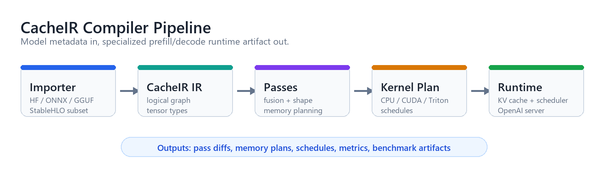
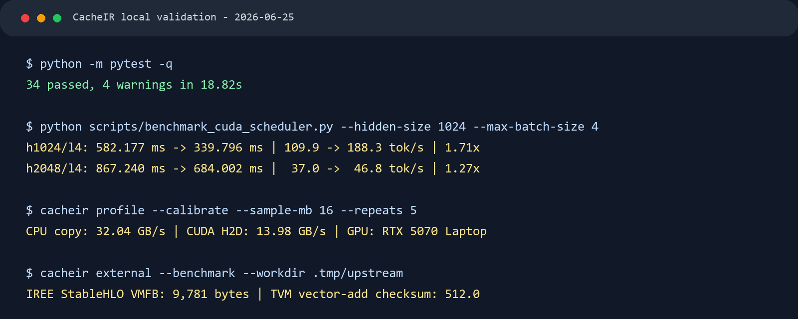
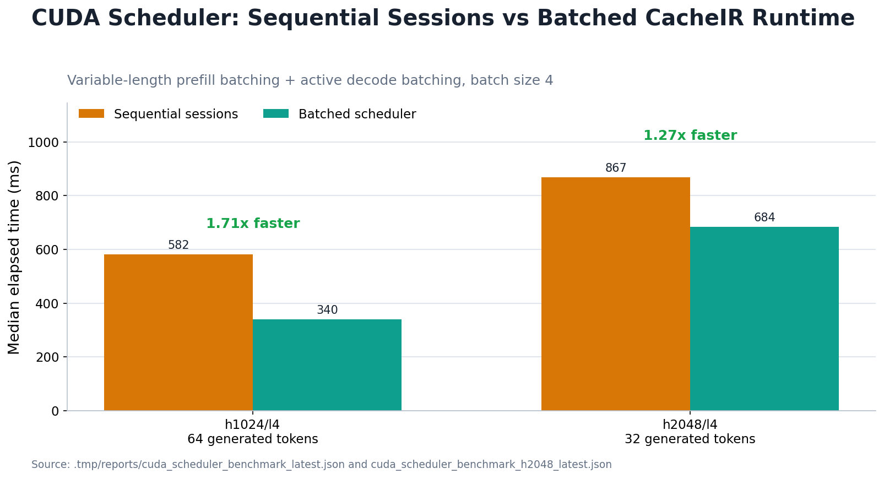
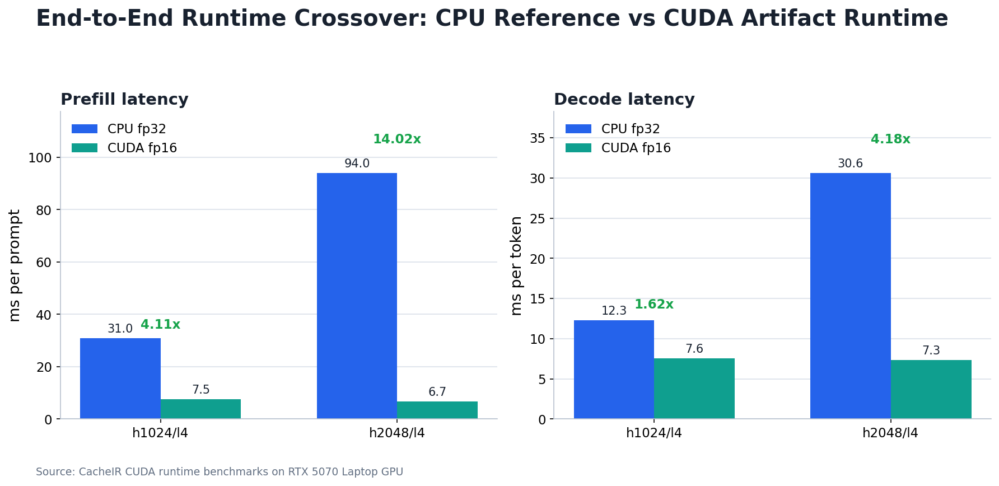
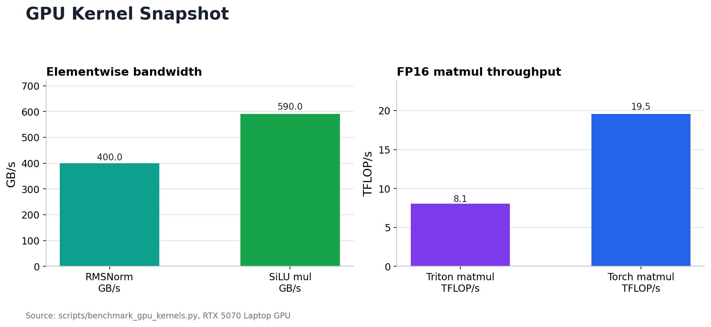

# CacheIR

CacheIR is a narrow, inspectable compiler and runtime for decoder-only transformer
inference. It imports a Llama/Mistral/Qwen-style model, lowers it into its own IR,
runs transformer-specific optimization passes, plans memory and execution, selects
backend kernels, and executes inference through a reference runtime.

It is not a PyTorch wrapper and it is not a vLLM clone. The default runtime backend
is a NumPy CPU correctness backend with native acceleration hooks, plus an
optional CUDA artifact runtime that executes the same lowered graph on GPU
tensors with fp16 weights, persistent page-backed CUDA KV storage, SDPA attention,
Triton elementwise kernels, packed QKV/Gate-Up dispatch, and fused paged decode
attention over shared page tables. CacheIR also includes prefix-cache reuse, a
continuous-batch scheduler with backpressure/fairness/preemption controls,
OpenAI-compatible serving, optional C++20/OpenMP AVX2/AVX512 kernels exposed
through pybind11, guarded Triton kernels, optional CUDA fused-kernel sources,
optional accelerator adapters, CUDA graph capture plans, calibrated KV spillover
cost models, packed int4/int8 loader integration, and experimental import/export
surfaces for GGUF, StableHLO, and MLIR-style CacheIR.

## Visual Snapshot

<p align="center">
  
</p>

<p align="center">
  
</p>

## Why CacheIR Exists

Most ML compiler stacks are powerful but broad and opaque. LLM serving has a very
specific shape: prefill is compute-heavy, decode is KV-cache and memory-bandwidth
heavy, and transformer optimizations need to be visible to be trusted.

CacheIR focuses on that smaller problem:

- compile prefill and decode as separate graph modes
- lower attention into explicit KV-cache-aware operations
- expose every pass as a graph diff
- emit memory plans and execution schedules
- run a real end-to-end reference path without PyTorch execution
- benchmark prefill and decode separately

## Current Capabilities

| Layer | Status |
| --- | --- |
| Model import | Hugging Face config + NPZ/safetensors metadata, ONNX graph skeleton, GGUF metadata plus dense F32/F16/BF16/I8/I16/I32/I64/F64, classic quant reads, and optional reference K/IQ/TQ/NV/MX dequantization, broader StableHLO text/region subset |
| IR | CacheIR JSON/text graph format, tensor types, weight specs, attrs, pass traces |
| Compiler passes | shape inference, constant folding, QKV fusion, RMSNorm+QKV+RoPE fusion, SwiGLU fusion, prefill/decode specialization, layout conversion, quant-aware lowering, hardware hints, kernel selection, scheduling, memory planning |
| Runtime | NumPy CPU backend, CUDA artifact runtime, tokenizer bridge, CPU/GPU paged KV cache metadata, persistent shared CUDA page-backed KV pools, prefix-cache reuse with hit/miss counters, forked per-request KV sessions, continuous-batch scheduler, variable-length CUDA batched prefill, scheduler-integrated CUDA batched decode over shared page tables, queue backpressure, fairness aging, resumable preemption, bounded-latency counters, calibrated CPU/GPU spillover policy experiments, greedy streaming generation |
| Serving | OpenAI-compatible FastAPI server, streaming chat completions, `/healthz`, Prometheus-style `/metrics`, and CacheIR batch completions endpoint |
| Tooling | CLI, artifact bundles, graph HTML/DOT/MLIR export, benchmark runner, scheduler benchmark, external comparison harness, hardware profiler with bandwidth calibration |
| Native backend | C++20/OpenMP library with AVX2/AVX512 dispatch, optional pybind11 bridge, native RMSNorm/matmul/SiLU-multiply kernels, guarded Triton RMSNorm/SwiGLU/QKV/RoPE/decode-attention kernels, Triton FP16 matmul, persistent multi-batch page-table Triton decode attention, optional CUDA fused-kernel, FP16 WMMA Tensor Core matmul, reduced paged-attention, and CUDA graph planning targets |

## Complete Tech Stack

| Area | Stack |
| --- | --- |
| Primary languages | Python 3.10+, C++20 |
| Python packaging | `pyproject.toml`, setuptools, editable installs, optional dependency groups |
| Core numerical runtime | NumPy reference kernels; optional PyTorch CUDA tensor substrate for the CacheIR CUDA executor |
| Compiler IR | Custom CacheIR graph IR, JSON artifacts, text IR dumps, pass diffs |
| Model import | Hugging Face `config.json`, NPZ reference weights, safetensors optional, ONNX optional, GGUF metadata and dense F32/F16/BF16/I8/I16/I32/I64/F64 plus Q4_0/Q4_1/Q5_0/Q5_1/Q8_0/Q8_1 native subset, optional `gguf` reference dequantization for supported K/IQ/TQ/NV/MX formats, StableHLO textual/region subset |
| Transformer architecture | Llama/Mistral/Qwen-style decoder-only blocks, RMSNorm, RoPE, grouped-query attention, SwiGLU, residual streams |
| Compiler passes | Shape inference, constant folding, QKV fusion, RMSNorm+QKV+RoPE fusion, SwiGLU fusion, prefill/decode specialization, layout conversion, quant-aware lowering, DCE, hardware hints, kernel selection, execution scheduling, static memory planning |
| Runtime systems | Weight loader, tokenizer bridge, paged KV cache, persistent CUDA page pools, CUDA-resident KV state, prefix-cache snapshots and counters, per-request KV sessions sharing weights/tokenizer, continuous-batch scheduler with queue limits, priorities, cancellation, backpressure waits, fairness aging, preemption, bounded queue-latency counters, variable-length CUDA prefill batching, scheduler-integrated CUDA decode batching, calibrated spillover policy hooks, backend dispatcher, greedy streaming decode loop |
| CPU backend | NumPy executable backend; C++20/OpenMP native library with scalar, AVX2/FMA, and AVX512 dispatch; optional pybind11 module `_cacheir_native`; runtime uses native RMSNorm/SiLU-multiply when available and keeps native matmul as an opt-in experiment via `CACHEIR_NATIVE_MATMUL=force` or `auto` |
| GPU backend surface | CUDA/Triton target naming, schedule generation, end-to-end `CudaRuntime`, fp16 CUDA weight loading, persistent GPU KV page pools, SDPA attention dispatch, cached packed QKV/Gate-Up weights, guarded Triton RMSNorm, SwiGLU, FP16 matmul, fused RMSNorm/QKV/RoPE, single-query decode attention, persistent multi-batch page-table decode attention kernels, shape-specific GEMM plan recording, cuBLASLt-through-Torch default matmul, opt-in Triton Tensor Core matmul; optional CUDA C++ fused-kernel, FP16 WMMA Tensor Core matmul, reduced paged-attention, and CUDA graph capture planning target |
| Accelerator adapters | Optional CUTLASS, FlashAttention, and FlashInfer probes/dispatch contracts plus guarded direct execution wrappers for prefill, single decode, and batch paged decode; CUTLASS detects the `nvidia-cutlass`/`cutlass_cppgen` wheel when installed |
| Quantization | int4/int8 graph lowering with real packed `uint8` storage, per-row scales, affine zero points, CPU and CUDA model-loader integration, dequant-at-GEMM-boundary execution, and quantized fused QKV/SwiGLU dispatch paths |
| Serving | FastAPI and Uvicorn optional dependencies, OpenAI-compatible `/v1/models`, `/v1/completions`, `/v1/chat/completions`, `/healthz`, `/metrics`, and `/v1/cacheir/batch_completions` |
| Benchmarks | Built-in benchmark CLI with CPU/CUDA backend selector, prefill/decode split metrics, benchmark matrix script, CUDA runtime benchmark, CUDA scheduler benchmark, continuous-batch scheduler benchmark, GPU kernel benchmark, comparison harness for vLLM, llama.cpp, TensorRT-LLM, MLC LLM, IREE, and TVM commands, installed IREE/TVM smoke benchmark execution, WSL vLLM/FlashInfer comparison runs, and Qwen 0.5B CacheIR/vLLM measurements |
| Visualization | HTML export, Graphviz DOT export, text IR export, MLIR-style CacheIR dialect export, parser round trip, and verifier |
| Native build | CMake, Ninja, OpenMP, pybind11 optional |
| Testing | pytest, Python bytecode compilation checks, CLI smoke tests, CMake build checks |
| Infrastructure | Dockerfile, Makefile, GitHub Actions |
| Documentation | Markdown docs and full LaTeX project documentation in `docs/latex/` |
| External context | vLLM, llama.cpp, IREE, TVM, StableHLO, MLIR, CUTLASS, FlashAttention/FlashInfer are comparison or optional integration surfaces, not default runtime dependencies |

## Install

```bash
python -m pip install -e ".[dev,server]"
```

Optional importer dependencies:

```bash
python -m pip install -e ".[importers,benchmark]"
```

Optional native/GPU dependency groups:

```bash
python -m pip install -e ".[native,gpu]"
cmake -S cpp -B cpp/build -DCACHEIR_BUILD_PYTHON=ON -DCMAKE_BUILD_TYPE=Release
cmake --build cpp/build --config Release
```

Optional accelerator adapter probes:

```bash
python -m pip install -e ".[accelerators]"
```

Optional upstream compiler/runtime comparison tools:

```bash
python -m pip install -e ".[upstream]"
```

On native Windows/Python 3.13, IREE and TVM install from wheels while vLLM,
FlashAttention, FlashInfer, and `llama-cpp-python` do not all provide compatible
wheels for this host. The CUDA validation path for those packages is WSL2:
`/home/bhatt/cacheir-llm-venv` has vLLM, FlashInfer, Triton, Torch, and
`llama-cpp-python`; `/home/bhatt/cacheir-tools/llama.cpp/build-cuda13/bin` has a
CUDA llama.cpp build. FlashInfer executed successfully in that environment.
FlashAttention, TensorRT-LLM, and MLC LLM are guarded optional surfaces here:
binary-only PyPI checks did not expose compatible wheels for this WSL venv, and
source-build attempts for FlashAttention/TensorRT-LLM were not retained because
they destabilized WSL. WSL also has NVIDIA CUDA Toolkit 13.3 installed at
`/usr/local/cuda` so FlashInfer JIT kernels can build. CacheIR keeps these
adapters and benchmark runners guarded so compatible Linux/CUDA environments can
execute them directly when the packages are available.

If CMake discovers the wrong Python on Windows, pin the active interpreter:

```bash
cmake -S cpp -B cpp/build-py-active \
  -DCACHEIR_BUILD_PYTHON=ON \
  -DPython3_EXECUTABLE="$(python -c 'import sys; print(sys.executable)')" \
  -DCMAKE_BUILD_TYPE=Release
cmake --build cpp/build-py-active --config Release
```

CUDA sources are enabled with `-DCACHEIR_BUILD_CUDA=ON`. On Windows, NVIDIA CUDA
requires the MSVC host compiler (`cl.exe`) on `PATH`; Linux builds can use the
normal CUDA host compiler flow. This workspace has Build Tools installed at
`C:\BuildTools` and `cl.exe` on the user PATH.

## Quickstart

Create a tiny Llama-shaped model, compile it, inspect the lowered graph, run
generation, and benchmark prefill/decode:

```bash
cacheir make-tiny examples/tiny_model
cacheir compile examples/tiny_model --output examples/tiny_artifact
cacheir inspect examples/tiny_artifact --mode decode
cacheir run examples/tiny_artifact --prompt "CacheIR" --max-new-tokens 16
cacheir benchmark examples/tiny_artifact --decode-tokens 32 --repeats 3
cacheir benchmark examples/tiny_artifact --backend cuda --cuda-dtype float16 --warmup 2
cacheir export examples/tiny_artifact examples/decode.html --mode decode
cacheir export examples/tiny_artifact examples/decode.mlir --mode decode --format mlir
```

The artifact directory contains:

```text
artifact.json              full machine-readable compiler artifact
graphs/prefill.cir         optimized prefill IR
graphs/decode.cir          optimized decode IR
schedules/*.json           runtime kernel schedule by mode
passes/*.diff              pass-by-pass graph diffs
```

## Python API

```python
from cacheir import Runtime, compile_model

artifact = compile_model(
    model_path="examples/tiny_model",
    target="cpu",
    quant=None,
    mode=["prefill", "decode"],
    max_seq=128,
)

rt = Runtime(artifact)
for token in rt.generate("Explain MLIR in simple terms", max_new_tokens=16):
    print(token, end="")
```

## Compiler Example

Logical transformer IR starts as separate operations:

```text
%attn_norm = rms_norm(%hidden, %attn_norm_w)
%q = matmul(%attn_norm, %q_proj_w)
%k = matmul(%attn_norm, %k_proj_w)
%v = matmul(%attn_norm, %v_proj_w)
%q_rope, %k_rope = rope(%q, %k)
%attn = grouped_query_attention(%q_rope, %k_rope, %v)
```

The decode-specialized graph lowers that into scheduled runtime calls:

```text
%q_rope, %k_rope, %v = fused_rmsnorm_qkv_rope(...)
%attn = paged_attention_decode(%q_rope, %k_rope, %v)
```

Every pass records before/after text and a unified diff:

```bash
cacheir inspect examples/tiny_artifact \
  --mode decode \
  --pass-name prefill_decode_specialization
```

## CLI

```bash
cacheir profile
cacheir profile --calibrate --sample-mb 16 --repeats 5
cacheir make-tiny MODEL_DIR
cacheir compile MODEL_DIR --target cpu --quant int4_awq --output ARTIFACT_DIR
cacheir compile model.stablehlo --target cpu --output stablehlo_artifact
cacheir inspect ARTIFACT_DIR --mode decode
cacheir export ARTIFACT_DIR graph.dot --format dot
cacheir export ARTIFACT_DIR graph.mlir --format mlir
cacheir benchmark ARTIFACT_DIR --prompt "hello" --decode-tokens 64 --repeats 5
cacheir benchmark ARTIFACT_DIR --backend cuda --cuda-dtype float16 --warmup 2
cacheir external --benchmark --workdir .tmp/upstream
cacheir run ARTIFACT_DIR --prompt "hello"
cacheir serve ARTIFACT_DIR --host 127.0.0.1 --port 8000 --max-batch-size 4 --max-queue-size 64
```

## Benchmarks

CacheIR reports prefill and decode separately because they stress different parts
of the system:

<p align="center">
  
</p>

| Result | Baseline | CacheIR path | Change |
| --- | ---: | ---: | ---: |
| h1024/l4 scheduler latency | 582.177 ms | 339.796 ms | 1.71x faster |
| h2048/l4 scheduler latency | 867.240 ms | 684.002 ms | 1.27x faster |
| h1024/l4 runtime prefill | 30.984 ms CPU | 7.533 ms CUDA | 4.11x faster |
| h2048/l4 runtime prefill | 94.036 ms CPU | 6.705 ms CUDA | 14.02x faster |

<p align="center">
  
</p>

<p align="center">
  
</p>

```bash
python scripts/benchmark_matrix.py --output benchmark_results.json --repeats 3 --decode-tokens 16
```

```json
{
  "prompt_tokens": 24,
  "decode_tokens": 32,
  "prefill_ms_avg": 4.2,
  "decode_ms_avg": 0.3,
  "prefill_tokens_per_s": 5714.0,
  "decode_tokens_per_s": 3333.0,
  "kv_cache": {"page_size": 16, "layers": {...}}
}
```

The CPU runtime keeps NumPy correctness coverage. Native RMSNorm and fused
SiLU-multiply dispatch automatically when `_cacheir_native` is available; native
matmul remains opt-in because the local AVX dot-loop kernel is not consistently
faster than NumPy's optimized contraction. CUDA kernels plug into the same
artifact and benchmark surfaces when built with a compatible CUDA host toolchain.

Continuous-batch scheduler benchmark:

```bash
python scripts/benchmark_scheduler.py \
  --output .tmp/reports/scheduler_benchmark.json \
  --repeats 3 \
  --max-new-tokens 8 \
  --max-batch-size 4
```

End-to-end CUDA runtime benchmark:

```bash
python scripts/benchmark_cuda_runtime.py \
  --output .tmp/reports/cuda_runtime_benchmark_h1024_latest.json \
  --repeats 3 \
  --warmup 1 \
  --decode-tokens 8 \
  --hidden-size 1024 \
  --num-layers 4 \
  --cuda-dtype float16
```

CUDA scheduler batching benchmark:

```bash
python scripts/benchmark_cuda_scheduler.py \
  --output .tmp/reports/cuda_scheduler_benchmark_latest.json \
  --repeats 3 \
  --warmup 1 \
  --max-batch-size 4 \
  --max-new-tokens 16 \
  --hidden-size 1024 \
  --num-layers 4 \
  --cuda-dtype float16
```

Persistent page-backed scheduler benchmark from this pass:

```bash
python scripts/benchmark_cuda_scheduler.py \
  --output .tmp/reports/cuda_scheduler_benchmark_persistent_post_production.json \
  --repeats 2 \
  --warmup 1 \
  --max-batch-size 4 \
  --max-new-tokens 8 \
  --hidden-size 512 \
  --num-layers 2 \
  --cuda-dtype float16 \
  --use-triton-attention
```

| Benchmark | Baseline | CacheIR path | Result |
| --- | ---: | ---: | ---: |
| h512/l2 scheduler, batch 4, persistent paged decode | 176.225 ms sequential | 78.491 ms batched | 2.25x lower latency |
| h512/l2 generated throughput | 184.0 tok/s sequential | 407.8 tok/s batched | 2.22x higher throughput |
| h512/l2 CUDA runtime prefill | 8.800 ms CPU | 3.515 ms CUDA | 2.50x faster |
| Qwen2.5-0.5B CacheIR CUDA | 16 input + 8 output | 233.8 ms/request | persistent decode kernel used 432 times |
| Qwen2.5-0.5B vLLM CUDA | 16 input + 8 output | 43.7 ms/request | vLLM remains 5.35x faster on this run |
| llama.cpp CUDA tiny GGUF | 16 prompt tokens | 6,120 tok/s | real `llama-bench` JSON run |
| llama.cpp CUDA tiny GGUF | 8 generated tokens | 2,044 tok/s | real `llama-bench` JSON run |

For apples-to-apples local comparisons, provide explicit external commands for
the tools installed on the machine:

```bash
python scripts/compare_external_benchmarks.py examples/tiny_artifact \
  --vllm-command "python bench_vllm.py" \
  --llama-command "llama-bench -m model.gguf" \
  --iree-command "iree-benchmark-module --module=model.vmfb" \
  --tvm-command "python bench_tvm.py" \
  --output benchmark_comparison.json
```

When IREE and TVM are installed but no explicit commands are supplied, CacheIR can
run built-in upstream smoke benchmarks:

```bash
python scripts/compare_external_benchmarks.py examples/tiny_artifact \
  --run-installed-smoke \
  --output benchmark_comparison.json
```

Latest local validation on 2026-06-29:

- Full optional project install passed with `python -m pip install -e ".[dev,server,importers,benchmark,native,gpu]"`.
- PyPI packages installed: `pybind11`, `triton-windows`, ONNX/importer deps, server deps, benchmark deps.
- MSVC Build Tools 2022 installed at `C:\BuildTools`; `cl.exe` resolves from the user PATH.
- CUDA Torch installed: `torch 2.12.1+cu130`; CUDA is available on the RTX 5070 Laptop GPU.
- `_cacheir_native.pyd` built with CMake and the active Python 3.13 interpreter.
- Native SIMD probe reported `avx512`.
- Native RMSNorm, matmul, and fused SiLU-multiply matched NumPy within float32 tolerance.
- Runtime matmul dispatch defaults to NumPy's optimized contraction; native matmul can be forced with `CACHEIR_NATIVE_MATMUL=force` or shape-gated with `CACHEIR_NATIVE_MATMUL=auto`.
- CUDA C++ target built with MSVC/NVCC: `cacheir_cuda_kernels.lib`.
- CUDA C++ FP16 WMMA Tensor Core matmul and reduced paged-attention decode paths built with MSVC/NVCC.
- End-to-end `CudaRuntime` executed full decoder artifacts on the RTX 5070 Laptop GPU with fp16 weights, GPU-resident KV state, SDPA attention, Triton elementwise kernels, and cached packed QKV/Gate-Up weights.
- CUDA runtime benchmark results: h1024/l4 CUDA fp16 measured 7.533 ms prefill and 7.573 ms/token decode versus CPU fp32 30.984 ms prefill and 12.271 ms/token decode; h2048/l4 CUDA fp16 measured 6.705 ms prefill and 7.333 ms/token decode versus CPU fp32 94.036 ms prefill and 30.619 ms/token decode.
- Scheduler-integrated CUDA batching executed variable-length prefill and active decode rounds across four requests. The benchmark processed 134 real prefill tokens plus 6 padding tokens. h1024/l4 batch-4 improved median latency from 582.177 ms to 339.796 ms and generated-token throughput from 109.9 tok/s to 188.3 tok/s, a 1.71x speedup. h2048/l4 batch-4 improved median latency from 867.240 ms to 684.002 ms and throughput from 37.0 tok/s to 46.8 tok/s, a 1.27x speedup.
- Triton batched decode attention smoke test executed through the scheduler path with `--use-triton-attention` on h128/l1, producing 3.36x latency/throughput speedup over sequential CUDA sessions for the tiny smoke shape.
- Triton GPU kernels executed on CUDA: RMSNorm 0.0157 ms, SiLU-multiply 0.0213 ms, FP16 matmul 0.0667 ms / 8.05 TFLOP/s, single-query decode attention 0.0552 ms, and multi-batch page-table decode attention 0.0566 ms on the RTX 5070 Laptop GPU.
- `cacheir profile --calibrate --sample-mb 16 --repeats 5` measured CPU copy at 32.04 GB/s and CUDA H2D at 13.98 GB/s on this host.
- `nvidia-cutlass 4.2.0.0` installed and the CUTLASS adapter probe detects `cutlass_cppgen`.
- `iree-base-compiler 3.11.0`, `iree-base-runtime 3.11.0`, and `apache-tvm 0.25.0` installed from PyPI.
- `cacheir external --benchmark --workdir .tmp/reports/upstream_latest` compiled StableHLO through IREE to a 9,781-byte VMFB and ran `iree-benchmark-module`; TVM built and ran a TE vector-add benchmark with checksum 512.0.
- WSL2 CUDA environment validated direct FlashInfer decode execution through CacheIR's adapter wrappers. FlashAttention is guarded but not importable in the current WSL venv; binary-only PyPI checks found no compatible wheel.
- A CUDA llama.cpp build ran a real `llama-bench` model benchmark against a locally converted GGUF tiny Llama model; the JSON result is in `.tmp/upstream/llama_cpp_tiny_benchmark.json`.
- The vLLM model benchmark runner installs a process-local no-UVA fallback shim before vLLM workers initialize and now prepends the CacheIR project root plus `/usr/local/cuda/bin` so spawned vLLM workers can import the shim and FlashInfer can find `nvcc`.
- WSL2 root installed NVIDIA CUDA Toolkit 13.3 at `/usr/local/cuda` from NVIDIA's Ubuntu 24.04 repo; no Linux NVIDIA driver package was installed.
- A runnable WSL2 CUDA vLLM environment is available at `/home/bhatt/cacheir-llm-venv`; vLLM with Torch 2.11.0+cu130 and FlashInfer ran a real latency benchmark on Qwen2.5-0.5B-Instruct: 43.697 ms average request latency for 16 input + 8 output tokens after warmup.
- CacheIR compiled and executed Qwen2.5-0.5B-Instruct on CUDA with persistent page-backed decode attention: 25.653 ms prefill, 25.993 ms/token decode, and 233.774 ms average request latency for the same 16 input + 8 output token shape.
- CacheIR's persistent page-backed scheduler benchmark with Triton attention enabled measured h512/l2 batch-4 latency at 78.491 ms versus 176.225 ms sequential, a 2.25x latency speedup and 2.22x generated-token throughput speedup.
- Packed int4/int8 quantized weights now use real compressed `uint8` storage, per-row scales, affine zero points, CPU/CUDA loader integration, and quantized matmul/fused-QKV/fused-SwiGLU dispatch.
- Scheduler hardening now includes blocking backpressure attempts, fairness aging, resumable preemption, request token limits, queue-wait accounting, and bounded-latency violation counters.
- Continuous-batch scheduler benchmark: 4 requests, 32 generated tokens, median 54.819 ms, 72.97 requests/s, 583.74 generated tokens/s, and 70 prompt tokens reused through prefix cache.
- Benchmark matrix ran 18 rows with 3 repeats and 16 decode tokens; medium_4l_h64 fp32 decode measured 2.217 ms/token on the short prompt and 2.169 ms/token on the medium prompt.
- Full pytest suite passed: 38 tests.
- The comparison harness can now run installed IREE/TVM smoke benchmarks plus model-aware vLLM and llama.cpp benchmark helpers when model paths are supplied.

## Development

```bash
python -m pytest -q
python -m compileall cacheir -q
cmake -S cpp -B cpp/build -DCMAKE_BUILD_TYPE=Release
cmake --build cpp/build --config Release
```


Project layout:

```text
cacheir/
  ir.py                  CacheIR graph IR
  compiler.py            importer selection and pass pipeline
  importers/             HF, ONNX, GGUF, StableHLO, tiny model support
  passes/                compiler passes
  runtime/               artifact, tokenizer, KV cache, CPU/CUDA runtimes, scheduler, server
  backends/              backend registry, optional native bridge, Triton kernels, upstream probes
cpp/                     C++20/OpenMP AVX backend and optional pybind11 module
docs/                    architecture, IR, runtime, benchmark notes
examples/                tiny model compile demo
scripts/                 benchmark matrix, scheduler, GPU, and upstream helpers
tests/                   pytest coverage
```

## Boundaries

Implemented and tested:

- CPU reference execution without PyTorch
- end-to-end CUDA artifact execution through `CudaRuntime`
- CUDA fp16 weight loading, GPU-resident KV state, SDPA attention dispatch, and cached packed QKV/Gate-Up decode weights
- scheduler-integrated variable-length CUDA prefill batching and active-request CUDA decode batching with server metrics
- shared CUDA KV page allocator accounting across forked request sessions
- scheduler admission controls: queue limits, request priorities, cancellation, and Prometheus counters
- prefill/decode graph specialization
- paged KV-cache reference behavior
- prefix-cache reuse and spillover policy experiments
- forked per-request runtime sessions sharing weights/tokenizer
- continuous-batch scheduler with prefix reuse metrics
- OpenAI-compatible server entrypoint with `/healthz`, `/metrics`, and CacheIR batch completions
- artifact bundles, pass diffs, graph export, benchmarks, scheduler benchmark, server entrypoint
- quantization-aware lowering with CPU-side quantize/dequantize simulation
- C++20 backend library build with scalar, AVX2/FMA, and AVX512 dispatch
- optional pybind11 bridge for native RMSNorm, matmul, and fused SiLU-multiply kernels
- default runtime dispatch to native RMSNorm/SiLU-multiply plus opt-in native matmul policy
- guarded Triton RMSNorm, SiLU/SwiGLU, fused RMSNorm/QKV/RoPE, and single-query decode attention kernels
- guarded Triton FP16 matmul kernel using `tl.dot`/Tensor Core lowering where available
- guarded Triton multi-batch page-table decode attention with GQA mapping
- optional CUDA C++ fused kernels for RMSNorm, SwiGLU, RMSNorm/QKV/RoPE, FP16 WMMA Tensor Core matmul, batched paged-attention ABI, and reduced paged-attention decode
- CUDA graph capture planning for decode replay loops
- native GGUF dense F32/F16/BF16/I8/I16/I32/I64/F64 plus Q4_0/Q4_1/Q5_0/Q5_1/Q8_0/Q8_1 tensor reads
- optional reference GGUF dequantization for K/IQ/TQ/NV/MX formats exposed by the `gguf` package
- StableHLO text importer with arithmetic, shape, broadcast, slice, reduce-region, and cast coverage
- MLIR-style CacheIR dialect emitter, parser round trip, and verifier
- optional upstream MLIR C++ dialect registration skeleton through `CACHEIR_BUILD_MLIR=ON`
- CUTLASS, FlashAttention, and FlashInfer adapter probes, dispatch contracts, and guarded direct wrappers for prefill, single decode, and batch paged decode
- direct FlashInfer smoke execution on WSL2 CUDA, with FlashAttention kept as a guarded adapter for environments that provide a compatible wheel
- vLLM no-UVA CUDA worker fallback and CUDA Toolkit path export for CacheIR-launched vLLM benchmarks
- calibrated low-VRAM KV spillover cost model with measured bandwidth calibration, transfer estimates, and resident-page budgeting
- IREE StableHLO compile/runtime benchmark integration through upstream IREE wheels
- TVM TE/TIR runtime benchmark integration through the upstream TVM wheel
- external benchmark comparison harness for vLLM, llama.cpp, IREE, and TVM, including installed IREE/TVM smoke runs and model-aware vLLM/llama.cpp helpers

CacheIR is now a real, inspectable transformer compiler/runtime project with
working serving surfaces, scheduler metrics, admission control, native CPU hooks,
an end-to-end CUDA runtime, scheduler-integrated CUDA batching, shared CUDA page
allocator accounting, GPU kernel microbenchmarks, and upstream comparison
harnesses. Remaining engineering work includes a true page-backed shared GPU KV
allocator used directly by fused attention kernels, packed quantized GEMM, tuned
cuBLASLt/CUTLASS/Triton matmul selection, robust model coverage, and large-model
benchmark evidence. Remaining work is tracked in `docs/roadmap.md`.

## License

Apache-2.0.
